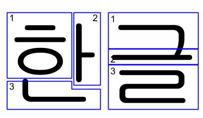

[**Retour à l'index**](indexLangues.md)
# La langue coréenne

## En bref

| Caractéristique | Coréen |
|---|---|
| **Ordre des mots** | SOV |
| **Type de langue** | Agglutinante |
| **Famille de langues** | Coréenne |
| **Système d'écriture** | Hangul |
| **Nombre de locuteurs natifs** | 77.2 millions |

Le japonais comporte divers niveaux de formalité selon à qui l'on s'adresse.

Si vous n'êtes pas familier avec ces termes, vous pouvez vous rendre à [cette page](typologie.md) pour les clarifier!

## À vos marques, prêts... Écrivez!

### 40 lettres!

Le coréen possède un alphabet appelé *hangeul* (한글). Cet alphabet comporte 19 consonnes et peut representer jusqu'à 21 voyelles, parfois en utilisant deux lettres. Voici l'ensemble des lettres :

(Les sons sont représentés à l'aide d'une translittération)

|Consonne|Son lorsque initiale|Son lorsque finale||Voyelle|Son|
|-|-|-|-|-|-|
|ㄱ|g|k||ㅐ|ae|
|ㄲ|kk|k||ㅑ|ya
|ㄴ|n|n||ㅒ|yae|
|ㄷ|d|t||ㅓ|eo
|ㄸ|tt|-||ㅔ|e|
|ㄹ|r|l||ㅕ|yeo
|ㅁ|m|m||ㅖ|ye
|ㅂ|b|p||ㅗ|o
|ㅃ|pp|-||ㅘ|wa
|ㅅ|s|t||ㅙ|wae
|ㅆ|ss|t||ㅚ|oe
|ㅇ|(Muet)|ng||ㅛ|yo
|ㅈ|j|t||ㅜ|u
|ㅉ|jj|-||ㅝ|wo
|ㅊ|ch|t||ㅞ|we
|ㅋ|k|k||ㅟ|wi
|ㅌ|t|t||ㅠ|yu
|ㅍ|p|p||ㅡ|eu
|ㅎ|h|t||ㅢ|ui
|||||ㅣ|i
|||||ㅏ|a

Mais, le nom même de la langue n'est pas fait comme cela me direz-vous. Ceci m'amène au deuxième point du système d'écriture : 

### Des blocs de lettres!

Voici comment on peut lire le mot 한글 (*Hangeul*) signifiant *coréen* : 

On sépare donc le bloc en plusieurs parties qui sont les lettres qui ont été présentées plus haut!

On lit les blocs de gauche à droite, puis du haut vers le bas, tel que vous pouvez le voir dans l'exemple de 한글 (*Hangeul*) signifiant *coréen*.

### Quelques caractères additionnels!

Les caractères chinois sont parfois utilisés dans la langue coréenne, où ils sont connus par le nom *hanja*. Voici les principaux endroits où ils sont utilisés :

- Clarifier des homophones
- Littérature ancienne
- Documents légaux
- Dictionnaires (Ils indiquent le *hanja* d'origine si le mot a été emprunté au chinois)
- Les noms propres

## Un ordre particulier!

Les phrases sont faites dans l'ordre SOV en coréen. C'est-à-dire que l'on écrit le sujet, suivi de l'objet pour terminer la phrase avec le verbe. Quelques exemples faciliteront la compréhension de ce phénomène : 

- Le sujet est écrit en bleu.
- L'objet est écrit en rouge.
- Le verbe est écrit en vert.

(Il est important de noter que les phrases sont conjuguées **de manière informelle**. Des formes plus polies et appropriées seront à apprendre si vous désirez poursuivre votre apprentissage du coréen.)

나는 사과를 먹는다. (Naneun sagwareul meokneunda) signifiant *Je mange une pomme*.

남자는 고양이를 본다. (Namjaneun goyangireul bonda) signifiant *L'homme voit le chat*.

여자는 책을 쓴다. (Yeoja chaekeun sseunda) signifiant *Une femme écrit un livre*.

## Faites attention à comment vous vous adressez aux autres!

Les coréens n'utilisent que rarement « tu » lorsqu'ils s'adressent à quelqu'un d'autre. Ils vont généralement préférer les appeler par un titre, comme :

- Leur position dans une entreprise
- Leur titre de famille (exemple: 오빠 (oppa) - grand frère pour une fille), on peut également référer à des inconnus par ces titres.
- Monsieur (아저씨 - Ajeossi) ou madame (아주머니 - ajumeoni)

On utilise seulement « tu » dans des situations informelles, entre amis par exemple (ou si l'on est des apprenants de la langue, puisque l'on est pas habitués à s'adresser à des vraies personnes).

La formalité de la situation **change les conjugaisons des verbes et adjectifs** pour les rendre plus polis. 

## Des expression fréquemment utilisées!

Voici quelques expressions fréquemment utilisées : 

|Français|Coréen (Poli)|Translittération|Coréen (Informel)|Translittération|
|-|-|-|-|-|
|Bonjour, je suis [prénom]. Enchanté(e)|안녕하세요. [Prénom]예요. 반가워요.|Annyeonghaseyo. [Prénom]eyo. Bangawoyo|안녕. [Prénom]야. 반가워.|Annyeong. [Prénom] ya. Bangawo.|
|Merci|감사합니다|Gamsahamnida||고마워|Gomawo|
|Au revoir (lorsqu'on part)|아니에요|Annyeonghi gyeseyo|잘 있어|Jal isseo
|Au revoir (lorsque quelqu'un part)|안녕히 가세요|Annyeonghi gaseyo|잘 가|Jal ga
|Excusez-moi|실례함니다|Silryehamnida|-|-|
|Je suis désolé(e)|죄송합니다|Joisonghamnida|미안해|Mianhae

## Un peu de vocabulaire!

## Bibliographie

- Wikipédia. *List of languages by total number of speakers*, 12 octobre 2018, URL : https://en.wikipedia.org/wiki/List_of_languages_by_total_number_of_speakers
- MARTIN, Samuel E. *Korean Language*, 1er mars 2011, URL: https://academic-eb-com.res.banq.qc.ca/levels/collegiate/article/Korean-language/109804
- AGER, Simon. *Index of languages by language family*, 2018, URL : http://www.omniglot.com/writing/langfam.htm
- HOW TO STUDY KOREAN. Lesson 5: Korean Conjugation: Past, Present, Future, 2018. URL : https://www.howtostudykorean.com/unit1/unit-1-lessons-1-8/unit-1-lesson-5/
- HOW TO STUDY KOREAN.  Lesson 1 : Basic Korean Sentences, 2018, URL : https://www.howtostudykorean.com/unit1/unit-1-lessons-1-8/unit-1-lesson-1/
- INNOVATIVE LANGUAGE LEARNING. Korean Dictionary, 2018
- Learn Korean with KoreanClass101.com. Learn Korean in 20 minutes - ALL the Basics You Need, 14 juillet 2017, URL: https://www.youtube.com/watch?v=ZinAK6n6cWU
- Wikipédia. Hanja, 30 septembre 2018, URL : https://en.wikipedia.org/wiki/Hanja
- Wikipédia. Hangul, 13 octobre 2018, URL : https://en.wikipedia.org/wiki/Hangul 
